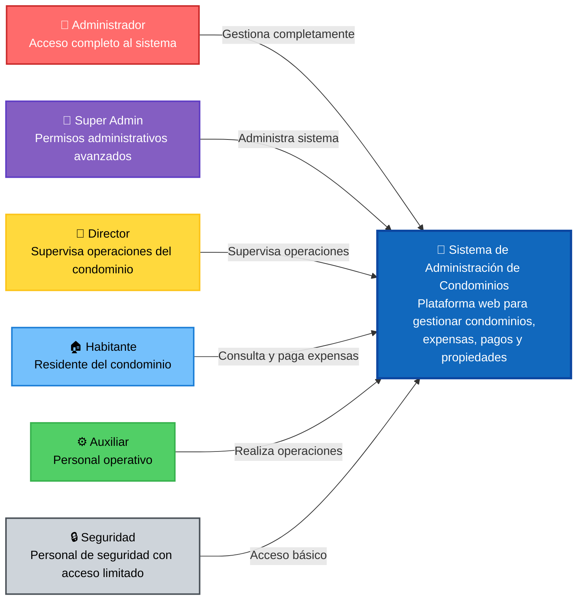

# Diagrama C4 - Contexto del Sistema

## Sistema de Administración de Condominios - Diagrama de Contexto (Nivel 1)

## Descripción

Este diagrama muestra la vista de contexto del sistema de administración de condominios, identificando:

### Usuarios del Sistema:

- **Administrador**: Acceso completo a todas las funcionalidades del sistema
- **Super Admin**: Permisos administrativos avanzados y configuración del sistema
- **Director**: Supervisa operaciones del condominio con permisos de gestión
- **Habitante**: Residentes que consultan y pagan sus expensas
- **Auxiliar**: Personal operativo con permisos para gestionar propiedades y expensas
- **Seguridad**: Personal de seguridad con acceso básico al sistema

### Sistema Principal:

- **Sistema de Administración de Condominios**: Plataforma web centralizada para la gestión integral de condominios, incluyendo expensas, pagos, propiedades y usuarios.

### Interacciones Principales:

Cada tipo de usuario interactúa con el sistema según su nivel de permisos y responsabilidades específicas.
