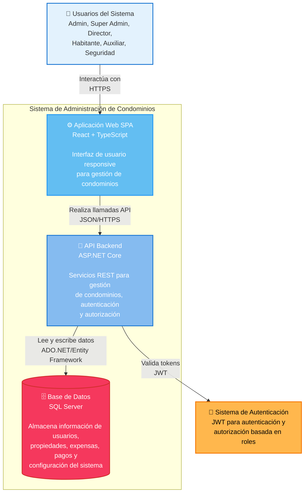

# Diagrama C4 - Contenedores del Sistema

## Sistema de Administración de Condominios - Diagrama de Contenedores (Nivel 2)

## Descripción

Este diagrama muestra los contenedores principales del sistema y cómo interactúan entre sí:

### Contenedores Principales:

#### **Frontend - Aplicación Web SPA**

- **Tecnología**: React + TypeScript
- **Responsabilidad**: Interfaz de usuario responsive
- **Puerto**: 3000 (desarrollo), 80/443 (producción)
- **Características**:
  - Single Page Application
  - Responsive design
  - Control de acceso basado en roles

#### **Backend - API REST**

- **Tecnología**: ASP.NET Core
- **Responsabilidad**: Servicios REST y lógica de negocio
- **Puerto**: 7221 (HTTPS)
- **Características**:
  - Autenticación JWT
  - Autorización basada en roles
  - Endpoints RESTful
  - Validación de datos

#### **Base de Datos**

- **Tecnología**: SQL Server
- **Responsabilidad**: Persistencia de datos
- **Puerto**: 1433
- **Datos almacenados**:
  - Usuarios y roles
  - Propiedades y propietarios
  - Expensas y pagos
  - Servicios y categorías
  - Configuración del sistema

### Sistemas Externos:

#### **Sistema de Autenticación JWT**

- Generación y validación de tokens
- Gestión de sesiones de usuario
- Control de expiración

#### **Pasarela de Pagos**

- Procesamiento de pagos de expensas
- Integración con bancos y tarjetas
- Confirmación de transacciones

### Protocolos de Comunicación:

- **HTTPS**: Para todas las comunicaciones web
- **JSON**: Formato de intercambio de datos
- **ADO.NET/Entity Framework**: Acceso a base de datos
