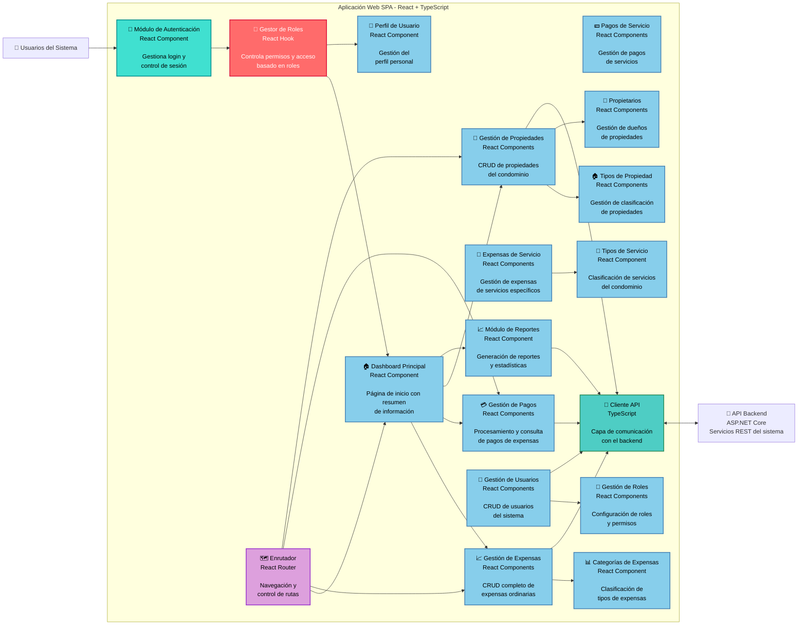

# Diagrama C4 - Componentes del Frontend

## Sistema de Administración de Condominios - Componentes del Frontend (Nivel 3)



## Descripción

Este diagrama detalla los componentes principales de la aplicación React frontend:

### Componentes de Autenticación y Seguridad:

- **Módulo de Autenticación**: Maneja el login/logout y control de sesión
- **Gestor de Roles**: Hook personalizado que controla permisos y acceso basado en roles de usuario

### Componentes Principales de Negocio:

#### **Gestión Financiera:**

- **Gestión de Expensas**: CRUD completo de expensas ordinarias
- **Expensas de Servicio**: Gestión específica de servicios del condominio
- **Gestión de Pagos**: Procesamiento de pagos de expensas
- **Pagos de Servicio**: Gestión de pagos de servicios específicos

#### **Gestión de Propiedades:**

- **Gestión de Propiedades**: CRUD de propiedades del condominio
- **Tipos de Propiedad**: Categorización de propiedades (apartamento, local, etc.)
- **Propietarios**: Gestión de dueños y asociación con propiedades

#### **Gestión de Usuarios:**

- **Gestión de Usuarios**: CRUD de usuarios del sistema
- **Gestión de Roles**: Configuración de roles y permisos
- **Perfil de Usuario**: Gestión de datos personales

#### **Configuración y Reportes:**

- **Categorías de Expensas**: Clasificación de tipos de gastos
- **Tipos de Servicio**: Categorización de servicios del condominio
- **Módulo de Reportes**: Generación de estadísticas y análisis

### Componentes de Infraestructura:

- **Cliente API**: Capa centralizada de comunicación con el backend
- **Enrutador**: Manejo de navegación con React Router
- **Dashboard Principal**: Página de inicio con resumen personalizado por rol

### Patrones de Arquitectura Frontend:

- **Hooks personalizados** para lógica reutilizable
- **Componentes modulares** por funcionalidad
- **Separación de responsabilidades** entre presentación y lógica
- **Control de acceso granular** basado en roles

```

```
