# Diagrama C4 - Componentes del Frontend

## Sistema de Administración de Condominios - Componentes del Frontend (Nivel 3)

```mermaid
flowchart LR
    %% Actores y Sistemas Externos
    Users[👥 Usuarios del Sistema]
    API[🚀 API Backend<br/>ASP.NET Core<br/>Servicios REST del sistema]

    %% Aplicación Frontend
    subgraph Frontend ["Aplicación Web SPA - React + TypeScript"]
        %% Autenticación y Seguridad
        Auth[🔐 Módulo de Autenticación<br/>React Component<br/><br/>Gestiona login y<br/>control de sesión]
        RoleManager[🔑 Gestor de Roles<br/>React Hook<br/><br/>Controla permisos y acceso<br/>basado en roles]
        Dashboard[🏠 Dashboard Principal<br/>React Component<br/><br/>Página de inicio con resumen<br/>de información]

        %% Gestión Financiera
        ExpensesMgmt[📈 Gestión de Expensas<br/>React Components<br/><br/>CRUD completo de<br/>expensas ordinarias]
        ServiceExpenses[🔧 Expensas de Servicio<br/>React Components<br/><br/>Gestión de expensas<br/>de servicios específicos]
        Payments[💳 Gestión de Pagos<br/>React Components<br/><br/>Procesamiento y consulta<br/>de pagos de expensas]
        ServicePayments[💵 Pagos de Servicio<br/>React Components<br/><br/>Gestión de pagos<br/>de servicios]

        %% Gestión de Propiedades
        Properties[🏢 Gestión de Propiedades<br/>React Components<br/><br/>CRUD de propiedades<br/>del condominio]
        PropertyTypes[🏠 Tipos de Propiedad<br/>React Components<br/><br/>Gestión de clasificación<br/>de propiedades]
        PropertyOwners[👥 Propietarios<br/>React Components<br/><br/>Gestión de dueños<br/>de propiedades]

        %% Gestión de Usuarios
        UserMgmt[👤 Gestión de Usuarios<br/>React Components<br/><br/>CRUD de usuarios<br/>del sistema]
        RolesMgmt[🔑 Gestión de Roles<br/>React Components<br/><br/>Configuración de roles<br/>y permisos]
        UserProfile[👤 Perfil de Usuario<br/>React Component<br/><br/>Gestión del<br/>perfil personal]

        %% Configuración
        Categories[📊 Categorías de Expensas<br/>React Component<br/><br/>Clasificación de<br/>tipos de expensas]
        ServiceTypes[🚀 Tipos de Servicio<br/>React Component<br/><br/>Clasificación de servicios<br/>del condominio]
        Reports[📈 Módulo de Reportes<br/>React Component<br/><br/>Generación de reportes<br/>y estadísticas]

        %% Infraestructura
        ApiClient[🔗 Cliente API<br/>TypeScript<br/><br/>Capa de comunicación<br/>con el backend]
        Router[🗺️ Enrutador<br/>React Router<br/><br/>Navegación y<br/>control de rutas]
    end

    %% Conexiones principales
    Users --> Auth
    Auth --> RoleManager
    RoleManager --> Dashboard

    Dashboard --> ExpensesMgmt
    Dashboard --> Payments
    Dashboard --> Properties
    Dashboard --> Reports

    ExpensesMgmt --> Categories
    ServiceExpenses --> ServiceTypes
    Properties --> PropertyTypes
    Properties --> PropertyOwners

    UserMgmt --> RolesMgmt
    RoleManager --> UserProfile

    %% Conexiones con API
    ApiClient <--> API
    ExpensesMgmt --> ApiClient
    Payments --> ApiClient
    Properties --> ApiClient
    UserMgmt --> ApiClient
    Reports --> ApiClient

    %% Enrutamiento
    Router --> Dashboard
    Router --> ExpensesMgmt
    Router --> Payments
    Router --> Properties

    %% Estilos
    classDef authStyle fill:#40E0D0,stroke:#008B8B,stroke-width:2px,color:#000000
    classDef roleStyle fill:#FF6B6B,stroke:#DC143C,stroke-width:2px,color:#ffffff
    classDef apiStyle fill:#4ECDC4,stroke:#2E8B57,stroke-width:2px,color:#000000
    classDef componentStyle fill:#87CEEB,stroke:#4682B4,stroke-width:2px,color:#000000
    classDef infrastructureStyle fill:#DDA0DD,stroke:#9932CC,stroke-width:2px,color:#000000

    class Auth authStyle
    class RoleManager roleStyle
    class ApiClient apiStyle
    class ExpensesMgmt,ServiceExpenses,Payments,ServicePayments,Properties,PropertyTypes,PropertyOwners,UserMgmt,RolesMgmt,UserProfile,Categories,ServiceTypes,Reports,Dashboard componentStyle
    class Router infrastructureStyle
```



## Descripción

Este diagrama detalla los componentes principales de la aplicación React frontend:

### Componentes de Autenticación y Seguridad:

- **Módulo de Autenticación**: Maneja el login/logout y control de sesión
- **Gestor de Roles**: Hook personalizado que controla permisos y acceso basado en roles de usuario

### Componentes Principales de Negocio:

#### **Gestión Financiera:**

- **Gestión de Expensas**: CRUD completo de expensas ordinarias
- **Expensas de Servicio**: Gestión específica de servicios del condominio
- **Gestión de Pagos**: Procesamiento de pagos de expensas
- **Pagos de Servicio**: Gestión de pagos de servicios específicos

#### **Gestión de Propiedades:**

- **Gestión de Propiedades**: CRUD de propiedades del condominio
- **Tipos de Propiedad**: Categorización de propiedades (apartamento, local, etc.)
- **Propietarios**: Gestión de dueños y asociación con propiedades

#### **Gestión de Usuarios:**

- **Gestión de Usuarios**: CRUD de usuarios del sistema
- **Gestión de Roles**: Configuración de roles y permisos
- **Perfil de Usuario**: Gestión de datos personales

#### **Configuración y Reportes:**

- **Categorías de Expensas**: Clasificación de tipos de gastos
- **Tipos de Servicio**: Categorización de servicios del condominio
- **Módulo de Reportes**: Generación de estadísticas y análisis

### Componentes de Infraestructura:

- **Cliente API**: Capa centralizada de comunicación con el backend
- **Enrutador**: Manejo de navegación con React Router
- **Dashboard Principal**: Página de inicio con resumen personalizado por rol

### Patrones de Arquitectura Frontend:

- **Hooks personalizados** para lógica reutilizable
- **Componentes modulares** por funcionalidad
- **Separación de responsabilidades** entre presentación y lógica
- **Control de acceso granular** basado en roles

```

```
