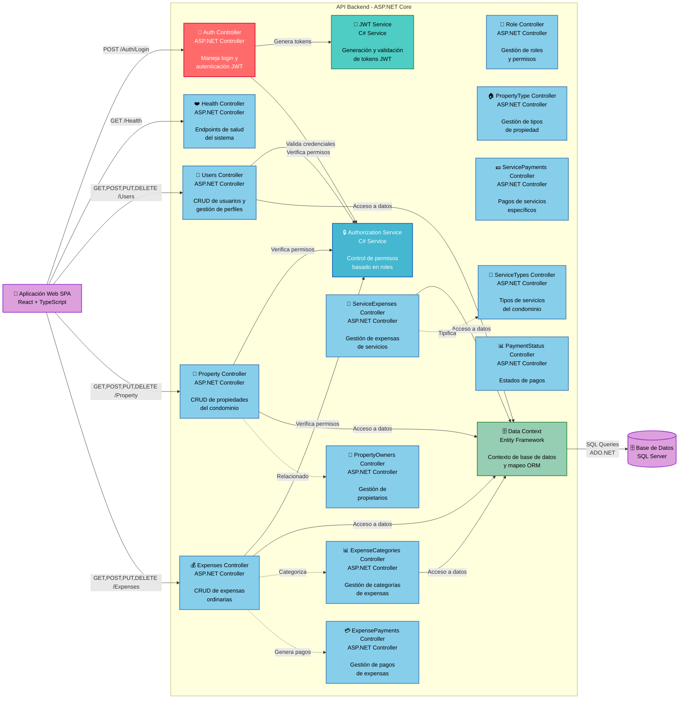

# Diagrama C4 - Componentes del Backend

## Sistema de Administración de Condominios - Componentes del Backend API (Nivel 3)



## Descripción

Este diagrama muestra la arquitectura interna del API backend construido con ASP.NET Core:

### Controllers (Controladores REST):

#### **Autenticación y Seguridad:**

- **Auth Controller**: `/Auth/Login` - Manejo de autenticación
- **Health Controller**: `/Health` - Monitoreo de salud del sistema

#### **Gestión de Usuarios:**

- **Users Controller**: `/Users` - CRUD de usuarios
- **Role Controller**: `/Role` - Gestión de roles y permisos

#### **Gestión de Propiedades:**

- **Property Controller**: `/Property` - CRUD de propiedades
- **PropertyType Controller**: `/PropertyType` - Tipos de propiedad
- **PropertyOwners Controller**: `/PropertyOwners` - Gestión de propietarios

#### **Gestión Financiera:**

- **Expenses Controller**: `/Expenses` - Expensas ordinarias
- **ExpenseCategories Controller**: `/ExpenseCategories` - Categorización
- **ExpensePayments Controller**: `/ExpensePayments` - Pagos de expensas

#### **Servicios del Condominio:**

- **ServiceExpenses Controller**: `/ServiceExpenses` - Expensas de servicios
- **ServicePayments Controller**: `/ServicePayments` - Pagos de servicios
- **ServiceTypes Controller**: `/ServiceTypes` - Tipos de servicios

#### **Estados y Control:**

- **PaymentStatus Controller**: `/PaymentStatus` - Estados de pagos

### Servicios de Negocio:

#### **JWT Service**

- **Responsabilidad**: Generación y validación de tokens JWT
- **Funciones**:
  - Crear tokens con claims de usuario
  - Validar tokens entrantes
  - Gestionar expiración de sesiones

#### **Authorization Service**

- **Responsabilidad**: Control de permisos basado en roles
- **Funciones**:
  - Validar credenciales de usuario
  - Verificar permisos por endpoint
  - Control de acceso granular

#### **Data Context (Entity Framework)**

- **Responsabilidad**: Acceso a datos y mapeo ORM
- **Funciones**:
  - Mapeo objeto-relacional
  - Gestión de conexiones a BD
  - Transacciones y migraciones

### Patrones de Arquitectura Backend:

- **Arquitectura en capas**: Controllers → Services → Data Access
- **Inyección de dependencias**: Para servicios y contextos
- **Middleware de autenticación**: JWT Bearer Token
- **Validación de modelos**: Data Annotations y FluentValidation
- **Manejo centralizado de errores**: Exception middleware

### Endpoints Principales:

```

GET /Health - Health check
POST /Auth/Login - Autenticación
GET /Users/me - Perfil del usuario actual
GET /Property/ByUser - Propiedades del usuario
GET /Expenses - Lista de expensas
POST /ExpensePayments - Procesar pago

```

```

```
