# Diagrama C4 - Flujo de Permisos y Accesos

## Flujo de Permisos y Accesos por Rol de Usuario

```mermaid
flowchart TD
    A[Usuario ingresa al sistema] --> B{Tipo de Usuario}

    B -->|Habitante| C[Dashboard Habitante]
    B -->|Auxiliar| D[Dashboard Operativo]
    B -->|Director| E[Dashboard Directivo]
    B -->|Admin/Super| F[Dashboard Administrativo]
    B -->|Seguridad| G[Dashboard Seguridad]

    C --> C1[Ver expensas propias]
    C --> C2[Pagar expensas]
    C --> C3[Ver propiedades propias]
    C --> C4[Gestionar perfil]

    D --> D1[Gestión de expensas]
    D --> D2[Categorías de expensas]
    D --> D3[Gestión de propiedades]
    D --> D4[Pagos y cobros]
    D --> D5[Propietarios]
    D --> D6[Reportes operativos]

    E --> E1[Supervisión de expensas]
    E --> E2[Reportes directivos]
    E --> E3[Gestión de propiedades]
    E --> E4[Pagos generales]

    F --> F1[Todos los módulos]
    F --> F2[Gestión de usuarios]
    F --> F3[Configuración de roles]
    F --> F4[Reportes completos]
    F --> F5[Configuración del sistema]

    G --> G1[Vista básica]
    G --> G2[Perfil personal]

    H[(Base de Datos)] --> I[Propiedades]
    H --> J[Usuarios]
    H --> K[Expensas]
    H --> L[Pagos]
    H --> M[Servicios]
    H --> N[Roles y permisos]

    C1 -.-> K
    C2 -.-> L
    C3 -.-> I
    D1 -.-> K
    D3 -.-> I
    D4 -.-> L
    F2 -.-> J
    F3 -.-> N

    style B fill:#97c2fc,stroke:#2d8cee,stroke-width:2px
    style F fill:#ff6b6b,stroke:#c92a2a,stroke-width:2px
    style E fill:#ffd93d,stroke:#fcc419,stroke-width:2px
    style D fill:#51cf66,stroke:#37b24d,stroke-width:2px
    style C fill:#74c0fc,stroke:#1c7ed6,stroke-width:2px
    style G fill:#ced4da,stroke:#495057,stroke-width:2px
    style H fill:#f06292,stroke:#e91e63,stroke-width:2px
```

## Descripción

Este diagrama ilustra el sistema de control de acceso basado en roles (RBAC) implementado en el sistema:

### Roles de Usuario y Permisos:

#### **🔒 Seguridad** (Acceso Mínimo)

- **Permisos limitados**: Solo vista básica y perfil personal
- **Uso típico**: Personal de seguridad del condominio
- **Módulos accesibles**:
  - Dashboard básico
  - Gestión de perfil personal

#### **🏠 Habitante** (Acceso de Residente)

- **Enfoque**: Autoservicio para residentes
- **Funcionalidades principales**:
  - Consultar sus propias expensas
  - Realizar pagos de expensas
  - Ver información de sus propiedades
  - Gestionar su perfil personal
- **Restricciones**: Solo puede acceder a su propia información

#### **🎯 Director** (Acceso de Supervisión)

- **Rol ejecutivo**: Supervisión y toma de decisiones
- **Funcionalidades adicionales**:
  - Supervisión de expensas generales
  - Reportes directivos y análisis
  - Gestión general de propiedades
  - Consulta de pagos y cobranzas
- **Enfoque**: Información consolidada para toma de decisiones

#### **⚙️ Auxiliar** (Acceso Operativo)

- **Rol operacional**: Gestión día a día del condominio
- **Funcionalidades amplias**:
  - Gestión completa de expensas
  - Administración de categorías
  - CRUD de propiedades
  - Gestión de pagos y cobros
  - Administración de propietarios
  - Generación de reportes operativos
- **Características**: Acceso operativo sin permisos administrativos del sistema

#### **👤 Administrador** (Acceso Completo)

- **Rol administrativo**: Control total del sistema
- **Acceso a todos los módulos**:
  - Todas las funcionalidades operativas
  - Gestión completa de usuarios
  - Configuración de roles y permisos
  - Reportes completos y análisis
  - Configuración del sistema
- **Responsabilidades**: Administración integral de la plataforma

#### **👑 Super Admin** (Acceso Total)

- **Rol de sistema**: Control absoluto del sistema
- **Permisos idénticos al Admin** pero con:
  - Capacidades especiales de configuración
  - Acceso a configuraciones avanzadas del sistema
  - Responsabilidad sobre otros administradores

### Flujo de Autorización:

1. **Autenticación**: Usuario ingresa credenciales
2. **Identificación de rol**: Sistema determina el rol del usuario
3. **Carga de dashboard**: Se presenta la interfaz personalizada según el rol
4. **Control granular**: Cada acción se valida contra los permisos del rol
5. **Acceso a datos**: Los datos se filtran según el nivel de acceso del usuario

### Implementación Técnica:

- **Frontend**: Control de UI basado en `useUserRole` hook
- **Backend**: Middleware de autorización en cada endpoint
- **Base de datos**: Tabla de roles con permisos granulares
- **JWT**: Tokens incluyen información de roles para validación
