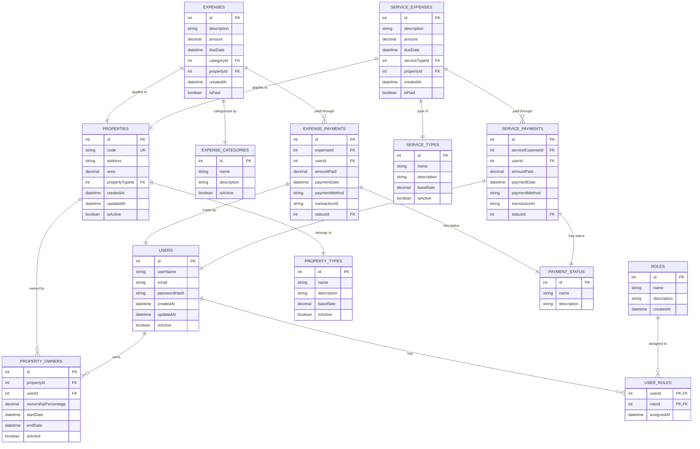

# Diagrama Entidad-Relación (ERD)

## Base de Datos del Sistema de Administración de Condominios

## Descripción del Modelo de Datos

### Entidades Principales:

#### **👥 Gestión de Usuarios y Seguridad**

**USERS (Usuarios)**

- `id`: Identificador único del usuario
- `userName`: Nombre de usuario único
- `email`: Correo electrónico único
- `passwordHash`: Contraseña encriptada
- `createdAt/updatedAt`: Fechas de auditoría
- `isActive`: Estado activo/inactivo del usuario

**ROLES (Roles del Sistema)**

- `id`: Identificador único del rol
- `name`: Nombre del rol (admin, super, director, habitante, auxiliar, seguridad)
- `description`: Descripción detallada del rol
- `createdAt`: Fecha de creación

**USER_ROLES (Asignación de Roles)**

- Tabla de unión muchos a muchos entre usuarios y roles
- `userId`: Referencia al usuario
- `roleId`: Referencia al rol
- `assignedAt`: Fecha de asignación del rol

#### **🏢 Gestión de Propiedades**

**PROPERTIES (Propiedades)**

- `id`: Identificador único de la propiedad
- `code`: Código único de la propiedad (ej: "A101", "B205")
- `address`: Dirección completa
- `area`: Área en metros cuadrados
- `propertyTypeId`: Tipo de propiedad
- `isActive`: Estado activo/inactivo

**PROPERTY_TYPES (Tipos de Propiedad)**

- `id`: Identificador único del tipo
- `name`: Nombre del tipo (apartamento, local, parqueadero, etc.)
- `description`: Descripción del tipo
- `baseRate`: Tarifa base para cálculos
- `isActive`: Estado activo/inactivo

**PROPERTY_OWNERS (Propietarios)**

- `id`: Identificador único
- `propertyId`: Propiedad asociada
- `userId`: Usuario propietario
- `ownershipPercentage`: Porcentaje de propiedad (0-100)
- `startDate/endDate`: Período de propiedad
- `isActive`: Estado de la relación

#### **💰 Gestión Financiera - Expensas**

**EXPENSE_CATEGORIES (Categorías de Expensas)**

- `id`: Identificador único
- `name`: Nombre de la categoría (mantenimiento, limpieza, etc.)
- `description`: Descripción detallada
- `isActive`: Estado activo/inactivo

**EXPENSES (Expensas)**

- `id`: Identificador único de la expensa
- `description`: Descripción detallada del gasto
- `amount`: Monto total de la expensa
- `dueDate`: Fecha de vencimiento
- `categoryId`: Categoría de la expensa
- `propertyId`: Propiedad a la que se aplica
- `isPaid`: Estado de pago

**EXPENSE_PAYMENTS (Pagos de Expensas)**

- `id`: Identificador único del pago
- `expenseId`: Expensa que se está pagando
- `userId`: Usuario que realiza el pago
- `amountPaid`: Monto pagado
- `paymentDate`: Fecha del pago
- `paymentMethod`: Método de pago utilizado
- `transactionId`: ID de la transacción externa
- `statusId`: Estado del pago

#### **🔧 Gestión de Servicios**

**SERVICE_TYPES (Tipos de Servicio)**

- `id`: Identificador único
- `name`: Nombre del servicio (ascensor, piscina, etc.)
- `description`: Descripción del servicio
- `baseRate`: Tarifa base del servicio
- `isActive`: Estado activo/inactivo

**SERVICE_EXPENSES (Expensas de Servicio)**

- `id`: Identificador único
- `description`: Descripción del gasto de servicio
- `amount`: Monto del servicio
- `dueDate`: Fecha de vencimiento
- `serviceTypeId`: Tipo de servicio
- `propertyId`: Propiedad que consume el servicio
- `isPaid`: Estado de pago

**SERVICE_PAYMENTS (Pagos de Servicio)**

- Similar a EXPENSE_PAYMENTS pero específico para servicios
- Permite tracking separado de pagos de servicios vs expensas ordinarias

#### **📊 Estados y Control**

**PAYMENT_STATUS (Estados de Pago)**

- `id`: Identificador único
- `name`: Nombre del estado (pendiente, pagado, fallido, etc.)
- `description`: Descripción del estado

### Relaciones Clave:

1. **Usuarios ↔ Roles**: Relación muchos a muchos (un usuario puede tener múltiples roles)
2. **Propiedades ↔ Usuarios**: Relación muchos a muchos a través de PROPERTY_OWNERS (múltiples propietarios por propiedad)
3. **Expensas → Propiedades**: Una expensa se aplica a una propiedad específica
4. **Pagos → Usuarios**: Un pago es realizado por un usuario específico
5. **Categorización**: Tanto expensas como servicios tienen sus propias categorías

### Características del Modelo:

- **Auditoría**: Fechas de creación y modificación en entidades principales
- **Soft Delete**: Campo `isActive` para eliminación lógica
- **Flexibilidad**: Soporte para múltiples propietarios y roles por usuario
- **Trazabilidad**: IDs de transacción para integración con pasarelas de pago
- **Escalabilidad**: Separación clara entre expensas ordinarias y servicios
