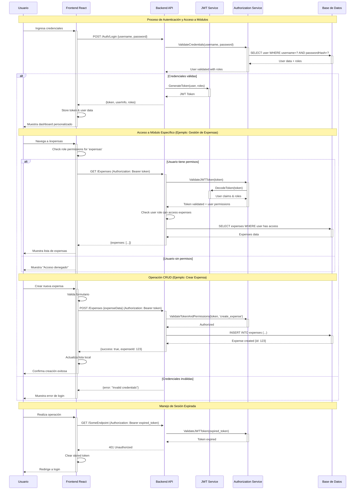

# Diagrama de Secuencia - Autenticación y Acceso

## Autenticación y Acceso a Módulos del Sistema

## Descripción del Flujo

Este diagrama de secuencia ilustra los procesos críticos de autenticación y autorización del sistema:

### 1. **🔐 Proceso de Autenticación**

#### Pasos del Login:

1. **Entrada de Credenciales**: Usuario ingresa username/password
2. **Validación en Backend**: API recibe credenciales y las valida
3. **Consulta a Base de Datos**: Verificación de usuario y obtención de roles
4. **Generación de Token**: Si es válido, se genera JWT con claims del usuario
5. **Respuesta al Frontend**: Token y información del usuario son enviados
6. **Almacenamiento Local**: Frontend guarda token para futuras requests

#### Características del Token JWT:

- **Claims incluidos**: ID de usuario, roles, fecha de expiración
- **Algoritmo**: RS256 para mayor seguridad
- **Expiración**: Configurable (ej: 24 horas)
- **Refresh**: Soporte para renovación automática

### 2. **🛂 Control de Acceso a Módulos**

#### Verificación de Permisos:

1. **Check Frontend**: Antes de mostrar UI, se validan permisos localmente
2. **Header de Autorización**: Cada request incluye `Authorization: Bearer token`
3. **Validación de Token**: Backend decodifica y valida el JWT
4. **Check de Permisos**: Se verifica si el rol puede acceder al recurso
5. **Filtrado de Datos**: Los datos se filtran según el nivel de acceso

#### Ejemplo Práctico - Módulo de Expensas:

- **Habitante**: Solo ve sus propias expensas
- **Auxiliar**: Ve todas las expensas, puede crearlas
- **Director**: Ve todas, puede aprobar
- **Admin**: Acceso completo

### 3. **✏️ Operaciones CRUD**

#### Flujo de Creación:

1. **Validación Frontend**: Formulario se valida antes del envío
2. **Request Autenticado**: POST con token en header
3. **Autorización Granular**: Verificación específica para `create_expense`
4. **Persistencia**: Inserción en base de datos
5. **Respuesta**: Confirmación con ID del nuevo registro
6. **Actualización UI**: Frontend actualiza la interfaz

#### Características de Seguridad:

- **Validación dual**: Frontend (UX) + Backend (seguridad)
- **Permisos granulares**: No solo por módulo, sino por operación
- **Auditoría**: Todos los cambios quedan registrados

### 4. **⏰ Manejo de Sesiones Expiradas**

#### Flujo de Expiración:

1. **Request con Token Expirado**: Usuario intenta operación
2. **Validación Fallida**: Backend detecta token expirado
3. **Respuesta 401**: Unauthorized response
4. **Limpieza Local**: Frontend elimina token almacenado
5. **Redirección**: Usuario es enviado al login

#### Estrategias de Renovación:

- **Auto-refresh**: Renovación automática antes de expiración
- **Refresh tokens**: Tokens de renovación de larga duración
- **Notificación proactiva**: Advertencia antes de expiración

### 5. **🔒 Características de Seguridad Implementadas**

#### Protecciones:

- **HTTPS Only**: Todas las comunicaciones encriptadas
- **Token Signing**: Tokens firmados criptográficamente
- **Rate Limiting**: Prevención de ataques de fuerza bruta
- **CORS Configuration**: Control de orígenes permitidos
- **Input Validation**: Validación de todos los inputs

#### Logging y Auditoría:

- **Authentication Events**: Login/logout registrados
- **Authorization Failures**: Intentos de acceso no autorizado
- **Data Access**: Registro de accesos a datos sensibles
- **Error Tracking**: Monitoreo de errores de seguridad

### 6. **🚀 Optimizaciones de Rendimiento**

#### Caching:

- **Token Validation**: Cache de tokens válidos
- **User Permissions**: Cache de permisos por rol
- **Database Connections**: Pool de conexiones

#### Estrategias:

- **Lazy Loading**: Carga de permisos bajo demanda
- **Batch Operations**: Agrupación de validaciones
- **Async Processing**: Operaciones no bloqueantes
