# Diagrama de Casos de Uso

## Casos de Uso por Rol de Usuario

```mermaid
graph TB
    %% Actores
    Admin[👤 Administrador]
    Super[👑 Super Admin]
    Director[🎯 Director]
    Habitante[🏠 Habitante]
    Auxiliar[⚙️ Auxiliar]
    Seguridad[🔒 Seguridad]

    %% Casos de uso principales
    subgraph "Sistema de Administración de Condominios"

        subgraph "Gestión de Autenticación"
            UC1[Iniciar Sesión]
            UC2[Gestionar Perfil]
            UC3[Cerrar Sesión]
        end

        subgraph "Gestión de Expensas"
            UC4[Ver Expensas]
            UC5[Crear Expensas]
            UC6[Editar Expensas]
            UC7[Eliminar Expensas]
            UC8[Categorizar Expensas]
        end

        subgraph "Gestión de Pagos"
            UC9[Pagar Expensas]
            UC10[Ver Historial de Pagos]
            UC11[Generar Recibos]
            UC12[Gestionar Estados de Pago]
        end

        subgraph "Gestión de Propiedades"
            UC13[Ver Propiedades]
            UC14[Crear Propiedades]
            UC15[Editar Propiedades]
            UC16[Gestionar Tipos de Propiedad]
            UC17[Gestionar Propietarios]
        end

        subgraph "Gestión de Usuarios"
            UC18[Ver Usuarios]
            UC19[Crear Usuarios]
            UC20[Editar Usuarios]
            UC21[Asignar Roles]
            UC22[Gestionar Permisos]
        end

        subgraph "Gestión de Servicios"
            UC23[Ver Servicios]
            UC24[Crear Expensas de Servicio]
            UC25[Pagar Servicios]
            UC26[Gestionar Tipos de Servicio]
        end

        subgraph "Reportes y Análisis"
            UC27[Ver Dashboard]
            UC28[Generar Reportes]
            UC29[Exportar Datos]
        end
    end

    %% Conexiones por rol - Habitante (acceso limitado)
    Habitante --> UC1
    Habitante --> UC2
    Habitante --> UC3
    Habitante --> UC4
    Habitante --> UC9
    Habitante --> UC10
    Habitante --> UC13
    Habitante --> UC27

    %% Conexiones por rol - Seguridad (acceso muy limitado)
    Seguridad --> UC1
    Seguridad --> UC2
    Seguridad --> UC3
    Seguridad --> UC27

    %% Conexiones por rol - Director (supervisión)
    Director --> UC1
    Director --> UC2
    Director --> UC3
    Director --> UC4
    Director --> UC9
    Director --> UC10
    Director --> UC13
    Director --> UC23
    Director --> UC27
    Director --> UC28

    %% Conexiones por rol - Auxiliar (operativo)
    Auxiliar --> UC1
    Auxiliar --> UC2
    Auxiliar --> UC3
    Auxiliar --> UC4
    Auxiliar --> UC5
    Auxiliar --> UC6
    Auxiliar --> UC8
    Auxiliar --> UC9
    Auxiliar --> UC10
    Auxiliar --> UC11
    Auxiliar --> UC13
    Auxiliar --> UC14
    Auxiliar --> UC15
    Auxiliar --> UC16
    Auxiliar --> UC17
    Auxiliar --> UC18
    Auxiliar --> UC23
    Auxiliar --> UC24
    Auxiliar --> UC25
    Auxiliar --> UC26
    Auxiliar --> UC27
    Auxiliar --> UC28

    %% Conexiones por rol - Admin (acceso completo)
    Admin --> UC1
    Admin --> UC2
    Admin --> UC3
    Admin --> UC4
    Admin --> UC5
    Admin --> UC6
    Admin --> UC7
    Admin --> UC8
    Admin --> UC9
    Admin --> UC10
    Admin --> UC11
    Admin --> UC12
    Admin --> UC13
    Admin --> UC14
    Admin --> UC15
    Admin --> UC16
    Admin --> UC17
    Admin --> UC18
    Admin --> UC19
    Admin --> UC20
    Admin --> UC21
    Admin --> UC22
    Admin --> UC23
    Admin --> UC24
    Admin --> UC25
    Admin --> UC26
    Admin --> UC27
    Admin --> UC28
    Admin --> UC29

    %% Conexiones por rol - Super Admin (acceso total)
    Super --> UC1
    Super --> UC2
    Super --> UC3
    Super --> UC4
    Super --> UC5
    Super --> UC6
    Super --> UC7
    Super --> UC8
    Super --> UC9
    Super --> UC10
    Super --> UC11
    Super --> UC12
    Super --> UC13
    Super --> UC14
    Super --> UC15
    Super --> UC16
    Super --> UC17
    Super --> UC18
    Super --> UC19
    Super --> UC20
    Super --> UC21
    Super --> UC22
    Super --> UC23
    Super --> UC24
    Super --> UC25
    Super --> UC26
    Super --> UC27
    Super --> UC28
    Super --> UC29

    %% Estilos
    classDef adminStyle fill:#ff6b6b,stroke:#c92a2a,stroke-width:2px,color:#ffffff
    classDef superStyle fill:#845ec2,stroke:#5f3dc4,stroke-width:2px,color:#ffffff
    classDef directorStyle fill:#ffd93d,stroke:#fcc419,stroke-width:2px,color:#000000
    classDef auxiliarStyle fill:#51cf66,stroke:#37b24d,stroke-width:2px,color:#000000
    classDef habitanteStyle fill:#74c0fc,stroke:#1c7ed6,stroke-width:2px,color:#000000
    classDef seguridadStyle fill:#ced4da,stroke:#495057,stroke-width:2px,color:#000000

    class Admin adminStyle
    class Super superStyle
    class Director directorStyle
    class Auxiliar auxiliarStyle
    class Habitante habitanteStyle
    class Seguridad seguridadStyle
```

## Descripción de Casos de Uso

### **👤 Actores del Sistema**

#### **🔒 Seguridad**

- **Perfil**: Personal de seguridad del condominio
- **Acceso**: Mínimo y básico
- **Casos de uso permitidos**: 4 funcionalidades básicas

#### **🏠 Habitante**

- **Perfil**: Residentes/propietarios del condominio
- **Acceso**: Autoservicio limitado a sus propiedades
- **Casos de uso permitidos**: 8 funcionalidades de consulta y pago

#### **🎯 Director**

- **Perfil**: Director ejecutivo del condominio
- **Acceso**: Supervisión y análisis
- **Casos de uso permitidos**: 9 funcionalidades de gestión y reportes

#### **⚙️ Auxiliar**

- **Perfil**: Personal operativo del condominio
- **Acceso**: Operacional amplio sin permisos administrativos
- **Casos de uso permitidos**: 21 funcionalidades operativas

#### **👤 Administrador**

- **Perfil**: Administrador del sistema
- **Acceso**: Completo con gestión de usuarios
- **Casos de uso permitidos**: 28 funcionalidades (todas menos las de super admin)

#### **👑 Super Admin**

- **Perfil**: Super administrador del sistema
- **Acceso**: Total y absoluto
- **Casos de uso permitidos**: 29 funcionalidades (todas)

---

### **📋 Módulos y Casos de Uso Detallados**

#### **🔐 Gestión de Autenticación** (3 casos de uso)

- **UC1 - Iniciar Sesión**: Autenticación en el sistema
- **UC2 - Gestionar Perfil**: Editar información personal
- **UC3 - Cerrar Sesión**: Terminar sesión de usuario

**Acceso**: Todos los roles

#### **💰 Gestión de Expensas** (5 casos de uso)

- **UC4 - Ver Expensas**: Consultar expensas del condominio
- **UC5 - Crear Expensas**: Generar nuevas expensas
- **UC6 - Editar Expensas**: Modificar expensas existentes
- **UC7 - Eliminar Expensas**: Eliminar expensas (solo admin/super)
- **UC8 - Categorizar Expensas**: Gestionar categorías de gastos

**Acceso**:

- **Ver**: Habitante (propias), Director, Auxiliar, Admin, Super
- **Crear/Editar**: Auxiliar, Admin, Super
- **Eliminar**: Admin, Super
- **Categorizar**: Auxiliar, Admin, Super

#### **💳 Gestión de Pagos** (4 casos de uso)

- **UC9 - Pagar Expensas**: Procesar pagos de expensas
- **UC10 - Ver Historial de Pagos**: Consultar historial de pagos
- **UC11 - Generar Recibos**: Crear comprobantes de pago
- **UC12 - Gestionar Estados de Pago**: Administrar estados de transacciones

**Acceso**:

- **Pagar/Ver Historial**: Habitante (propios), Director, Auxiliar, Admin, Super
- **Generar Recibos**: Auxiliar, Admin, Super
- **Gestionar Estados**: Admin, Super

#### **🏢 Gestión de Propiedades** (5 casos de uso)

- **UC13 - Ver Propiedades**: Consultar propiedades del condominio
- **UC14 - Crear Propiedades**: Registrar nuevas propiedades
- **UC15 - Editar Propiedades**: Modificar datos de propiedades
- **UC16 - Gestionar Tipos de Propiedad**: Administrar categorías
- **UC17 - Gestionar Propietarios**: Administrar relaciones propiedad-usuario

**Acceso**:

- **Ver**: Habitante (propias), Director, Auxiliar, Admin, Super
- **Crear/Editar**: Auxiliar, Admin, Super
- **Gestionar Tipos/Propietarios**: Auxiliar, Admin, Super

#### **👥 Gestión de Usuarios** (5 casos de uso)

- **UC18 - Ver Usuarios**: Consultar usuarios del sistema
- **UC19 - Crear Usuarios**: Registrar nuevos usuarios
- **UC20 - Editar Usuarios**: Modificar datos de usuarios
- **UC21 - Asignar Roles**: Gestionar roles de usuarios
- **UC22 - Gestionar Permisos**: Configurar permisos del sistema

**Acceso**:

- **Ver**: Auxiliar, Admin, Super
- **Crear/Editar**: Admin, Super
- **Asignar Roles/Gestionar Permisos**: Admin, Super

#### **🔧 Gestión de Servicios** (4 casos de uso)

- **UC23 - Ver Servicios**: Consultar servicios del condominio
- **UC24 - Crear Expensas de Servicio**: Generar gastos por servicios
- **UC25 - Pagar Servicios**: Procesar pagos de servicios
- **UC26 - Gestionar Tipos de Servicio**: Administrar categorías de servicios

**Acceso**:

- **Ver**: Director, Auxiliar, Admin, Super
- **Crear/Gestionar Tipos**: Auxiliar, Admin, Super
- **Pagar**: Auxiliar, Admin, Super

#### **📊 Reportes y Análisis** (3 casos de uso)

- **UC27 - Ver Dashboard**: Acceder al panel principal
- **UC28 - Generar Reportes**: Crear reportes del sistema
- **UC29 - Exportar Datos**: Exportar información a archivos

**Acceso**:

- **Dashboard**: Todos (personalizado por rol)
- **Generar Reportes**: Director, Auxiliar, Admin, Super
- **Exportar Datos**: Admin, Super

---

### **🎯 Matriz de Permisos Resumida**

| Módulo            | Seguridad | Habitante  | Director      | Auxiliar      | Admin        | Super        |
| ----------------- | --------- | ---------- | ------------- | ------------- | ------------ | ------------ |
| **Autenticación** | ✅        | ✅         | ✅            | ✅            | ✅           | ✅           |
| **Expensas**      | ❌        | 👁️ Propias | 👁️ Todas      | ✅ CRUD       | ✅ CRUD      | ✅ CRUD      |
| **Pagos**         | ❌        | ✅ Propios | 👁️ Todos      | ✅ Gestión    | ✅ Completo  | ✅ Completo  |
| **Propiedades**   | ❌        | 👁️ Propias | 👁️ Todas      | ✅ CRUD       | ✅ CRUD      | ✅ CRUD      |
| **Usuarios**      | ❌        | ❌         | ❌            | 👁️ Lista      | ✅ CRUD      | ✅ CRUD      |
| **Servicios**     | ❌        | ❌         | 👁️ Todos      | ✅ CRUD       | ✅ CRUD      | ✅ CRUD      |
| **Reportes**      | 👁️ Básico | 👁️ Básico  | ✅ Directivos | ✅ Operativos | ✅ Completos | ✅ Completos |

**Leyenda:**

- ✅ Acceso completo
- 👁️ Solo lectura/consulta
- ❌ Sin acceso
