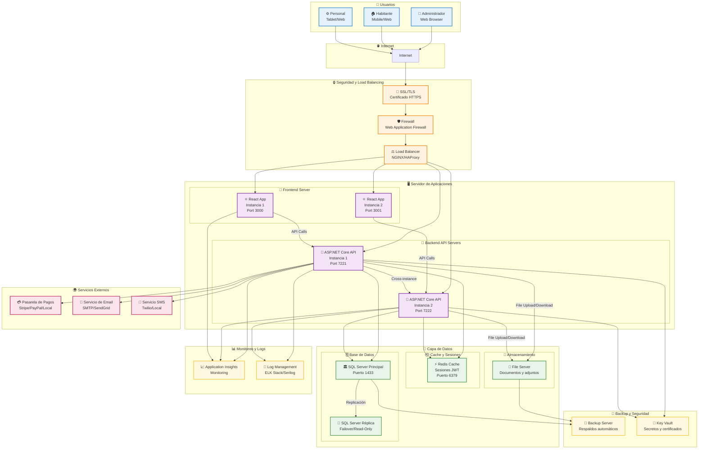

# Diagrama de Infraestructura y Deployment

## Infraestructura del Sistema de Administración de Condominios

## Descripción de la Infraestructura

### **👥 Capa de Usuario**

#### **Dispositivos Soportados**

- **Administradores**: Ordenadores con navegadores modernos
- **Habitantes**: Dispositivos móviles y web responsivo
- **Personal**: Tablets y computadoras para operaciones diarias

#### **Compatibilidad**

- **Navegadores**: Chrome, Firefox, Safari, Edge (últimas 2 versiones)
- **Dispositivos**: Desktop, tablet, móvil (responsive design)
- **Accesibilidad**: WCAG 2.1 AA compliance

---

### **🔒 Capa de Seguridad**

#### **SSL/TLS Termination**

- **Certificados**: Let's Encrypt o certificados comerciales
- **Protocolos**: TLS 1.2+ únicamente
- **Cipher Suites**: Solo algoritmos seguros (AES, ChaCha20)
- **HSTS**: HTTP Strict Transport Security habilitado

#### **Web Application Firewall (WAF)**

- **Protecciones**:
  - SQL Injection protection
  - XSS (Cross-Site Scripting) filtering
  - CSRF (Cross-Site Request Forgery) protection
  - Rate limiting por IP
  - Bot detection y mitigation
- **Reglas**: OWASP Core Rule Set

#### **Load Balancer**

- **Tecnología**: NGINX o HAProxy
- **Algoritmos**: Round-robin con health checks
- **Sticky Sessions**: Para aplicaciones con estado
- **SSL Offloading**: Terminación SSL en el balanceador

---

### **🖥️ Capa de Aplicación**

#### **Frontend Servers**

- **Tecnología**: React SPA servido por NGINX
- **Instancias**: 2+ para alta disponibilidad
- **Configuración**:
  - Gzip compression habilitado
  - Cache headers apropiados
  - Fallback a index.html para SPA routing
- **CDN**: CloudFlare o AWS CloudFront para assets estáticos

#### **Backend API Servers**

- **Tecnología**: ASP.NET Core en contenedores Docker
- **Instancias**: 2+ con auto-scaling
- **Configuración**:
  - Health check endpoints
  - Graceful shutdown handling
  - Connection pooling para base de datos
- **Runtime**: .NET 8.0+ con optimizaciones de performance

---

### **💾 Capa de Datos**

#### **Base de Datos Principal**

- **Tecnología**: SQL Server 2019+ o Azure SQL Database
- **Configuración**:
  - Always On Availability Groups para HA
  - Automatic failover configurado
  - Query optimization y indexing
  - Backup automatizado cada 15 minutos

#### **Base de Datos Secundaria**

- **Propósito**: Read-only replica para reportes
- **Configuración**:
  - Replicación asíncrona
  - Lag máximo de 5 segundos
  - Usado para consultas de solo lectura

#### **Cache Redis**

- **Uso**:
  - Sesiones de usuario (JWT blacklist)
  - Cache de consultas frecuentes
  - Rate limiting counters
- **Configuración**:
  - Cluster mode para alta disponibilidad
  - Persistencia RDB + AOF
  - Memoria: 4-8GB según carga

#### **File Server**

- **Propósito**: Almacenamiento de documentos y adjuntos
- **Tecnología**: MinIO (S3-compatible) o Azure Blob Storage
- **Características**:
  - Versioning habilitado
  - Lifecycle policies para archivos antiguos
  - Backup automático

---

### **🌍 Servicios Externos**

#### **Pasarela de Pagos**

- **Opciones**:
  - **Internacional**: Stripe, PayPal
  - **Local**: Integración con bancos locales
- **Características**:
  - PCI DSS compliance
  - Webhooks para confirmación de pagos
  - Retry logic para transacciones fallidas

#### **Servicio de Email**

- **Opciones**: SendGrid, AWS SES, SMTP local
- **Uso**:
  - Notificaciones de expensas
  - Recordatorios de pago
  - Confirmaciones de transacciones
- **Features**: Templates, tracking de entrega, bounce handling

#### **Servicio SMS**

- **Opciones**: Twilio, AWS SNS, proveedores locales
- **Uso**:
  - Verificación 2FA
  - Alertas críticas
  - Recordatorios de pago

---

### **📊 Monitoreo y Observabilidad**

#### **Application Performance Monitoring**

- **Herramientas**: Application Insights, New Relic, Datadog
- **Métricas**:
  - Response time por endpoint
  - Error rates y stack traces
  - Dependencias externas
  - User session analytics

#### **Log Management**

- **Stack**: ELK (Elasticsearch, Logstash, Kibana) o EFK (Fluentd)
- **Agregación**: Logs centralizados de todas las instancias
- **Retention**: 90 días para logs de aplicación, 1 año para logs de seguridad
- **Alertas**: Notificaciones automáticas por errores críticos

---

### **🔐 Backup y Disaster Recovery**

#### **Estrategia de Backup**

- **Base de Datos**:
  - Full backup diario
  - Differential backup cada 6 horas
  - Transaction log backup cada 15 minutos
- **Archivos**: Backup incremental diario
- **Configuración**: Backup semanal completo

#### **Disaster Recovery**

- **RTO (Recovery Time Objective)**: 4 horas
- **RPO (Recovery Point Objective)**: 15 minutos
- **Geo-redundancia**: Backups en región secundaria
- **Testing**: DR drills trimestrales

#### **Key Vault / Secrets Management**

- **Tecnología**: Azure Key Vault, HashiCorp Vault, AWS Secrets Manager
- **Almacenamiento seguro**:
  - Cadenas de conexión a BD
  - Claves API de servicios externos
  - Certificados SSL
- **Rotación automática**: Claves rotadas cada 90 días

---

### **🚀 Escalabilidad y Performance**

#### **Auto-scaling**

- **Métricas**: CPU, memoria, request count
- **Configuración**:
  - Scale out cuando CPU > 70%
  - Scale in cuando CPU < 30%
  - Mínimo 2 instancias, máximo 10

#### **Optimizaciones**

- **Database**: Connection pooling, query optimization
- **API**: Response caching, compression
- **Frontend**: Code splitting, lazy loading
- **CDN**: Static asset acceleration

#### **Capacity Planning**

- **Usuarios concurrentes**: 500-1000
- **Throughput**: 1000 requests/second
- **Storage**: 100GB inicial, crecimiento 20% anual
- **Bandwidth**: 10Mbps mínimo garantizado
