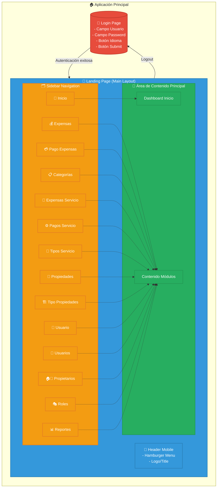
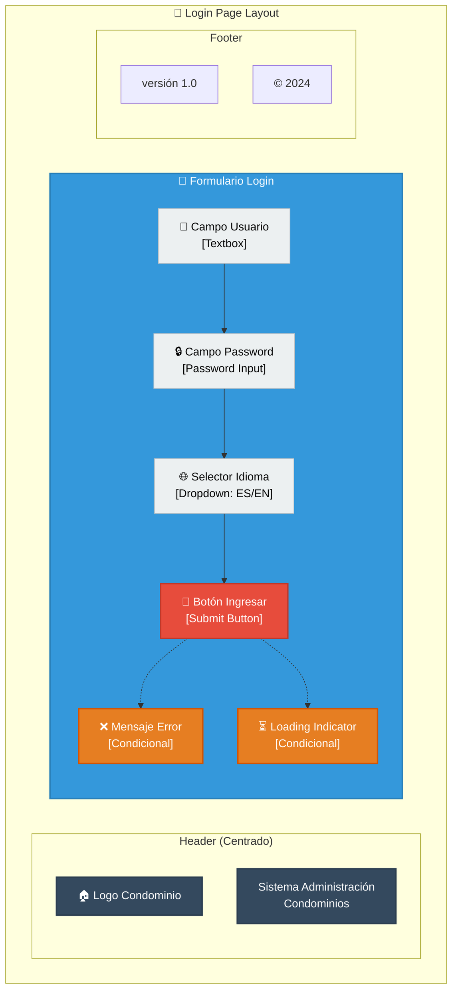
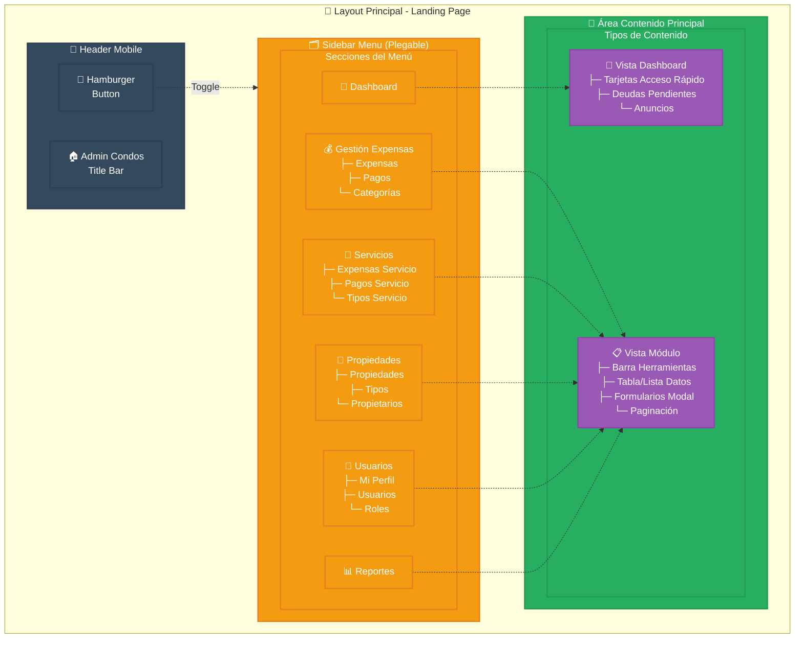
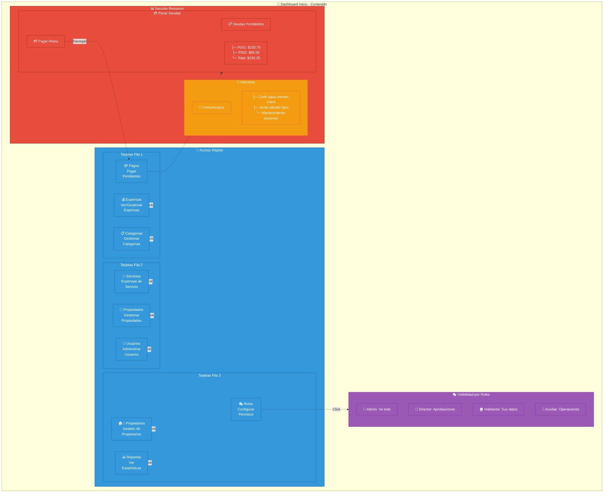
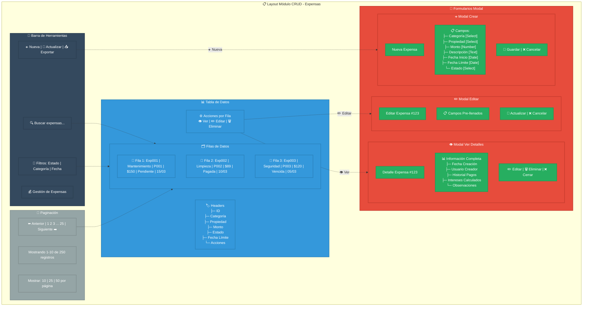
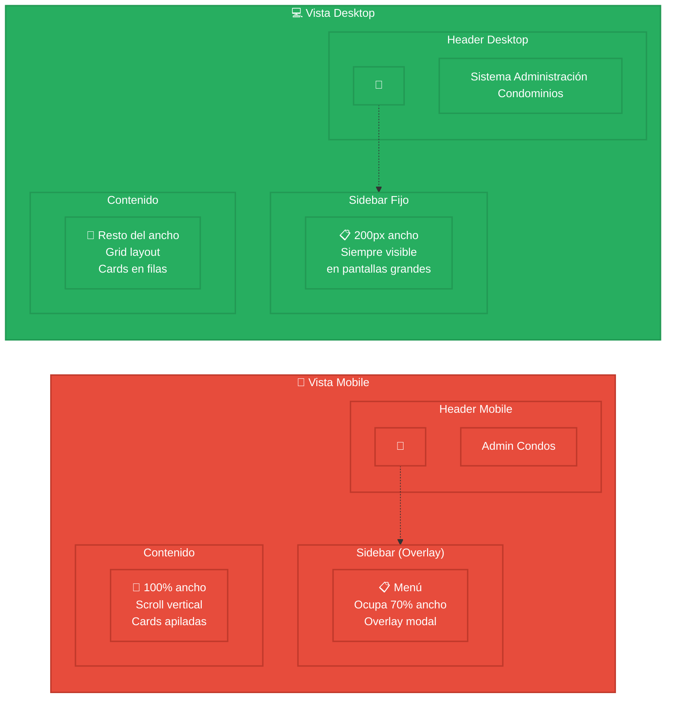
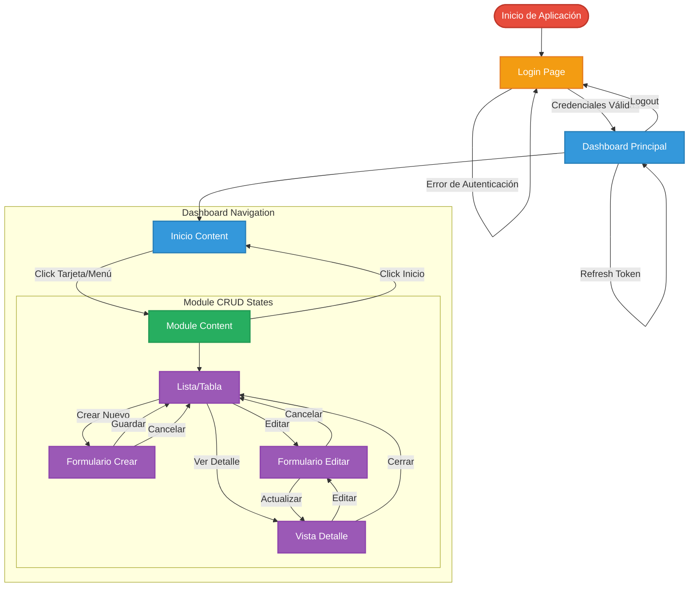

# Diagrama de Maquetado - Frontend Condo Admin

## Maquetado de Páginas Principal

## Wireframe Detallado - Página de Login

## Wireframe Detallado - Dashboard Principal

## Wireframe Dashboard - Vista Inicio

## Wireframe Módulo CRUD - Vista de Expensas

## Estados Responsivos - Móvil vs Desktop

## Flujo de Navegación y Estados

### Estados y Comportamientos por Componente

#### 🔐 **Login Page**

- **Loading**: Durante validación de credenciales
- **Error**: Mensaje de error por credenciales inválidas
- **Form Validation**: Validación en tiempo real de campos

#### 🏠 **Dashboard - Inicio**

- **Role-based**: Contenido adaptado según rol de usuario
- **Quick Access**: Tarjetas de navegación rápida
- **Summary**: Panel de deudas y anuncios

#### 📋 **Módulos CRUD**

- **List View**: Tabla con paginación, búsqueda y filtros
- **Create Form**: Modal/página para crear nuevos registros
- **Edit Form**: Modal/página para editar registros existentes
- **Detail View**: Vista completa de un registro específico

#### 🔄 **Estados Globales**

- **Authentication**: Control de sesión y tokens JWT
- **Loading**: Indicadores de carga durante operaciones
- **Error Handling**: Manejo centralizado de errores
- **Role Management**: Control de permisos y visibilidad

### **🏗️ Arquitectura del Frontend**

**Estructura Principal:**

1. **App.tsx**: Componente raíz que maneja autenticación y routing
2. **LoginPage**: Página de inicio de sesión con validación
3. **LandingPage**: Layout principal con sidebar y área de contenido
4. **Componentes de Módulo**: Cada funcionalidad tiene su componente dedicado

### **📱 Layout Responsivo**

**Desktop:**

- Sidebar fijo de 200px de ancho
- Área de contenido que ocupa el resto del espacio
- Navegación siempre visible

**Mobile:**

- Hamburger menu que muestra/oculta sidebar
- Sidebar overlay que ocupa 70% del ancho de pantalla
- Contenido a 100% de ancho con padding superior
- Transiciones suaves para mejor UX

### **🔐 Sistema de Roles**

**Control de Acceso:**

- **Admin**: Acceso completo a todos los módulos
- **Director**: Gestión y aprobaciones
- **Auxiliar**: Operaciones CRUD básicas
- **Habitante**: Solo sus datos personales
- **Seguridad**: Módulos específicos de vigilancia

**Visibilidad Dinámica:**

- Menú se adapta según roles del usuario
- Componentes se muestran/ocultan según permisos
- Validación tanto en frontend como backend

### **🎯 Módulos Principales**

**Gestión de Expensas:**

- CRUD completo de expensas
- Categorización y filtrado
- Seguimiento de estados de pago
- Cálculo de intereses

**Gestión de Propiedades:**

- Administración de unidades
- Tipos de propiedades
- Gestión de propietarios

**Sistema de Usuarios:**

- Perfiles de usuario
- Asignación de roles
- Gestión de permisos

### **⚙️ Funcionalidades Técnicas**

**Estado Global:**

- Manejo de autenticación con JWT
- Context para roles de usuario
- Estados de loading y error

**Comunicación API:**

- Headers de autorización en todas las requests
- Manejo de tokens expirados
- Refresh automático de sesión

**UX/UI:**

- Feedback visual inmediato
- Modales para formularios
- Paginación en tablas grandes
- Búsqueda y filtrado en tiempo real

### **🚀 Instrucciones para Draw.io**

1. **Importar los diagramas Mermaid:**
   - Copia el código de cada diagrama Mermaid
   - En Draw.io, ve a "Insertar" → "Advanced" → "Mermaid"
   - Pega el código y ajusta el estilo

2. **Personalizar el diseño:**
   - Cambiar colores de las cajas según tu paleta
   - Ajustar tamaños y espaciado
   - Agregar iconos personalizados

3. **Crear vistas adicionales:**
   - Layout específico para cada módulo
   - Flujos de usuario detallados
   - Wireframes de formularios complejos

**¿Te gustaría que modifique alguna parte específica del diagrama o que agregue más detalles a alguna sección en particular?**
